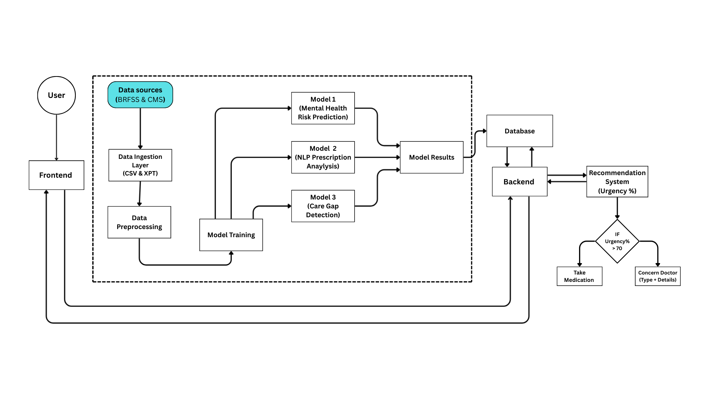

# 🧠 Mental Health Care Gap Analysis System

An AI-powered full-stack healthcare analytics system that predicts mental health risk, analyzes clinical text or medical reports using NLP + OCR, calculates urgency, and recommends care pathways or doctors.

---

# 🚀 Overview

The **Mental Health Care Gap Analysis System** is designed to:

- Predict mental health risk using structured health indicators
- Analyze clinical text or medical reports using ClinicalBERT
- Detect care gaps
- Calculate urgency score
- Recommend doctors or care pathways based on severity
- Provide a complete AI-driven healthcare decision support workflow

This system integrates Machine Learning, NLP, OCR, and a full-stack web application.

---

# 🏗 System Architecture



### 🔹 Architecture Flow

1. **User → Frontend**
2. Structured health inputs collected
3. Risk Prediction Model (XGBoost)
4. NLP Model (ClinicalBERT) for text/report analysis
5. Care Gap Detection
6. Urgency Calculation Engine
7. Backend Decision Engine
8. Doctor Recommendation System
9. Final Output to User

---

# 🧠 Models Used

## 🔹 Model 1 — Mental Health Risk Prediction
- Algorithm: XGBoost
- Input: 17 structured BRFSS-based features
- Output: Risk Score (0–100)

## 🔹 Model 2 — NLP Prescription Analysis
- Model: ClinicalBERT
- Supports:
  - Free text symptoms
  - Uploaded medical reports (via OCR)
- Output:
  - Anxiety
  - Stress
  - Depression
  - Sleep Severity

## 🔹 Model 3 — Care Gap Detection
- Combines:
  - Risk Score
  - Mental Severity Index
- Produces:
  - Urgency Percentage
  - Recommendation Decision

---

# 🖥 Tech Stack

### 🔹 Backend
- Flask
- PyTorch
- Transformers (HuggingFace)
- XGBoost
- Pandas
- OpenCV
- Tesseract OCR

### 🔹 Frontend
- React
- TypeScript
- Tailwind CSS
- Vite

---

# 📂 Project Structure
# 🧠 Mental Health Care Gap Analysis System

An AI-powered full-stack healthcare analytics system that predicts mental health risk, analyzes clinical text or medical reports using NLP + OCR, calculates urgency, and recommends care pathways or doctors.

---

## 🚀 Overview

The **Mental Health Care Gap Analysis System** is designed to:

- Predict mental health risk using structured health indicators
- Analyze clinical text or medical reports using ClinicalBERT
- Detect care gaps
- Calculate urgency score
- Recommend doctors or care pathways based on severity
- Provide a complete AI-driven healthcare decision support workflow

This system integrates Machine Learning, NLP, OCR, and a full-stack web application.

---

# 🏗 System Architecture


### 🔹 Architecture Flow

1. **User → Frontend**
2. Structured health inputs collected
3. Risk Prediction Model (XGBoost)
4. NLP Model (ClinicalBERT) for text/report analysis
5. Care Gap Detection
6. Urgency Calculation Engine
7. Backend Decision Engine
8. Doctor Recommendation System
9. Final Output to User

---

# 🧠 Models Used

## 🔹 Model 1 — Mental Health Risk Prediction
- Algorithm: XGBoost
- Input: 17 structured BRFSS-based features
- Output: Risk Score (0–100)

## 🔹 Model 2 — NLP Prescription Analysis
- Model: ClinicalBERT
- Supports:
  - Free text symptoms
  - Uploaded medical reports (via OCR)
- Output:
  - Anxiety
  - Stress
  - Depression
  - Sleep Severity

## 🔹 Model 3 — Care Gap Detection
- Combines:
  - Risk Score
  - Mental Severity Index
- Produces:
  - Urgency Percentage
  - Recommendation Decision

---

# 🖥 Tech Stack

### 🔹 Backend
- Flask
- PyTorch
- Transformers (HuggingFace)
- XGBoost
- Pandas
- OpenCV
- Tesseract OCR

### 🔹 Frontend
- React
- TypeScript
- Tailwind CSS
- Vite

---

# 📂 Project Structure

Mental-Health-Care-Gap-Analysis/
│
├── Backend/
│ ├── routes/
│ ├── services/
│ ├── utils/
│ ├── models/
│ ├── data/
│ ├── uploads/
│ ├── app.py
│ └── requirements.txt
│
├── frontend/
│ ├── src/
│ ├── components/
│ └── package.json
│
└── README.md

---

# ⚙️ Backend Setup

## 1️⃣ Create Virtual Environment

```bash
-cd Backend
-python -m venv venv
-venv\Scripts\activate
-pip install -r requirements.txt

Download:

👉 https://github.com/UB-Mannheim/tesseract/wiki

After installing, update path inside:
-Backend/utils/ocr.py

set:
-pytesseract.pytesseract.tesseract_cmd = r"C:\Program Files\Tesseract-OCR\tesseract.exe"

-python app.py

## ⚙️ Frontend Setup

cd frontend
npm install
npm run dev

🔐 Features

-Supports text OR image input (not both)
-OCR extraction for medical reports
-ClinicalBERT regression-based severity scoring
-Multi-factor urgency calculation
-Doctor recommendation filtering by city & state
-Clean full-stack integration
-JSON-safe model outputs

##📊 Dataset Sources:

-BRFSS (Behavioral Risk Factor Surveillance System)
-CMS data
-Clinical BERT Pretrained Model

##📈 Future Improvements:

-Real database integration (PostgreSQL / MongoDB)
-User authentication
-Dashboard analytics
-Real-time monitoring
-Deployment (Docker + Cloud)